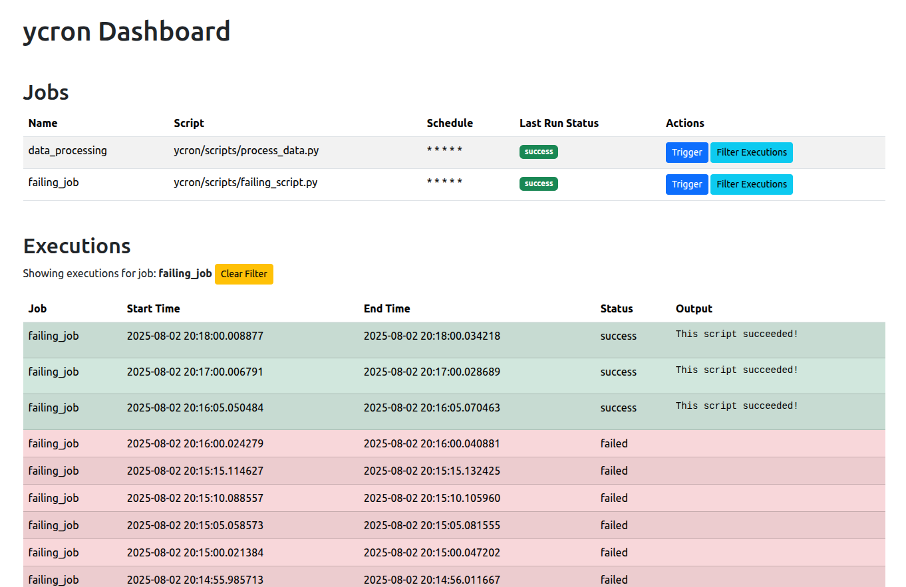

# ycron: Lightweight YAML-based Cronjob Management

## Overview

ycron (YAML + Cronjob) is a Python-based system for managing scheduled tasks. It provides enhanced monitoring, failure handling, and control over your cronjobs through simple YAML configuration.

**Why ycron?** Traditional cron lacks centralized visibility and robust error handling. ycron addresses this by offering a web interface for tracking job execution, managing retries, and backfilling missed runs. It's designed to be **significantly lighter than full-fledged orchestrators like Apache Airflow**, making it ideal for projects that need more than basic cron but don't require complex data pipeline management.

## Key Features

*   **YAML Configuration:** Define jobs, schedules (cron-like), retry policies, and backfill behavior in human-readable YAML files.
*   **Reliable Execution:** Automatic retries for transient failures and backfill for missed job runs (e.g., system downtime).
*   **Web Interface:** Centralized dashboard for:
    *   Monitoring job status and execution history.
    *   Manually triggering jobs.
    *   Filtering execution logs by job.
*   **Concurrency Control:** Limit parallel runs for individual jobs (`max_parallel`).
*   **SQLite Persistence:** Job definitions and execution history are stored locally.

## Development Status

| Feature                | Current Status | Future Plans    |
|------------------------|:-------------:|:---------------:|
| Core Scheduling        | ✅            | 🚀 Improvements |
| Web UI                 | 🟡 In Progress| ✅ Planned      |
| Notification System    | ❌            | 🟡 In Progress  |
| Plugin Support         | ❌            | ✅ Planned      |
| Documentation          | 🟡 Partial    | ✅ Planned      |

**Legend:**  
✅ Complete & Stable  
🟡 In Progress / Partial  
❌ Not Started  
🚀 Major Improvements Planned

## Installation and Usage

### Option 1: Clone and Install via setup.py

1.  **Clone the repository:**
    ```bash
    git clone https://github.com/ccomkhj/ycron.git
    cd ycron
    ```
2.  **Install using setup.py:**
    ```bash
    python3 setup.py install
    ```
    Or for development mode:
    ```bash
    python3 setup.py develop
    ```

### Option 2: Manual Dependency Installation

1.  **Install dependencies:**
    ```bash
    pip install -r requirements.txt
    ```
2.  **Configure your jobs:**
    Edit `ycron/config/jobs.yaml` to define your scheduled tasks. Refer to the example in the file for syntax.
3.  **Run the application:**
    ```bash
    python3 ycron.py
    ```
4.  **Access the Web GUI:**
    Open your web browser and navigate to `http://127.0.0.1:5000`.

## Web Dashboard

ycron provides a user-friendly web dashboard for managing and monitoring your scheduled tasks.



## Running Tests

To run the unit tests, navigate to the project root and execute:

```bash
python3 -m pytest ycron/tests/
```